# 1. Instalación de zonas mestras primarias
## 1.1 Instala o servidor BIND9 no equipo darthvader. Comproba que xa funciona coma servidor DNS caché pegando no documento de entrega a saída deste comando dig @localhost www.edu.xunta.es
### Salida comando: dig @localhost www.edu.xunta.es
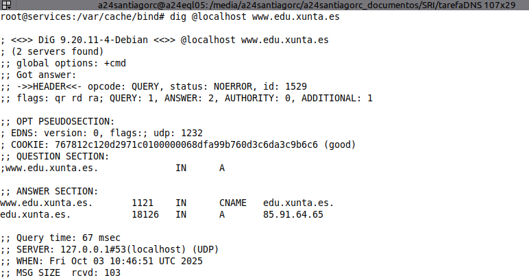
---
## 1.2. Configura o servidor BIND9 para que empregue como reenviador 8.8.8.8. pegando no documento de entrega contido do ficheiro /etc/bind/named.conf.options e a saída deste comando: dig @localhost www.mecd.gob.es
### Arquivo /etc/bind/named.conf.local
```
//
// Do any local configuration here
//

// Consider adding the 1918 zones here, if they are not used in your
// organization
//include "/etc/bind/zones.rfc1918";

// Zona directa para starwars.lan
zone "starwars.lan" {
    type master;
    file "/etc/bind/db.starwars.lan";
    allow-update { none; };
};

// Zona inversa para la red 192.168.20.0/24
zone "20.168.192.in-addr.arpa" {
    type master;
    file "/etc/bind/db.20.168.192";
    allow-update { none; };
};
```
### Salida comando: dig @localhost www.mecd.gob.es
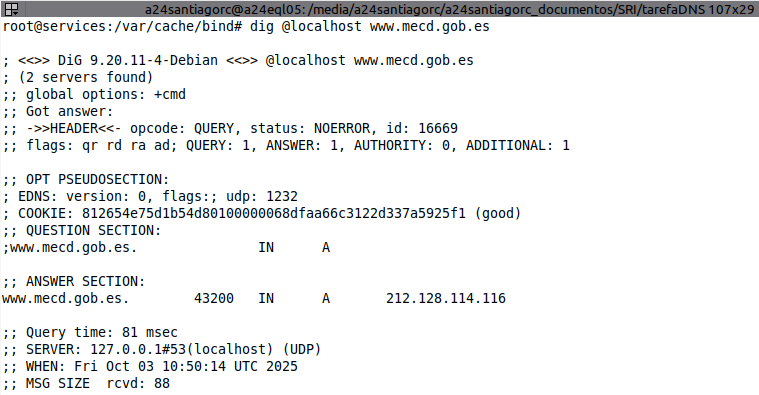
---
## 1.3. Instala unha zona primaria de resolución directa chamada "starwars.lan" e engade os seguintes rexistros de recursos (a maiores dos rexistros NS e SOA imprescindibles):
- Tipo A: darthvader con IP 192.168.20.10
- Tipo A: skywalker con IP 192.168.20.101
- Tipo A: skywalker con IP 192.168.20.111
- Tipo A: luke con IP 192.168.20.22
- Tipo A: darthsidious con IP 192.168.20.11
- Tipo A: yoda con IP 192.168.20.24 e 192.168.20.25
- Tipo A: c3p0 con IP 192.168.20.26
- Tipo CNAME palpatine a darthsidious
- TIPO MX con prioridade 10 sobre o equipo c3po
- TIPO TXT "lenda" con "Que a forza te acompanhe"
- TIPO NS con darthsidious
- Pega no documento de entrega o contido do arquivo de zona, e do arquivo /etc/bind/named.conf.local
### Arquivo db.starwars.lan
```
;
; Archivo de zona para starwars.lan.
;
$TTL    86400   ; TTL por defecto para todos los registros (1 día)
$ORIGIN starwars.lan.

; Registro SOA (Start of Authority)
@       IN      SOA     ns1.starwars.lan. admin.starwars.lan. (
                        1              ; Serial (AAAAMMDDNN)
                        3600           ; Refresh (1 hora)
                        1800           ; Retry (30 minutos)
                        1209600        ; Expire (2 semanas)
                        86400          ; Negative Cache TTL (1 día)
                        )

; Registro NS (Name Server)
@       IN      NS      darthsidious.starwars.lan.

; Registros A
@           IN      A       192.168.20.100
darthvader  IN      A       192.168.20.10
skywalker   IN      A       192.168.20.101
skywalker   IN      A       192.168.20.111
luke        IN      A       192.168.20.22
darthsidious    IN      A       192.168.20.11
yoda        IN      A       192.168.20.24
yoda        IN      A       192.168.20.25
c3p0        IN      A       192.168.20.26

; Registro MX (Mail Exchange)
@       IN      MX      10 c3po.starwars.lan.

; Registro TXT
lenda       IN      TXT     "Que a forza te acompanhe"

; Registro CNAME
palpatine   IN      CNAME   darthsidious.starwars.lan.
```
### Arquivo /etc/bind/named.conf.local
```
//
// Do any local configuration here
//

// Consider adding the 1918 zones here, if they are not used in your
// organization
//include "/etc/bind/zones.rfc1918";

// Zona directa para starwars.lan
zone "starwars.lan" {
    type master;
    file "/etc/bind/db.starwars.lan";
    allow-update { none; };
};

// Zona inversa para la red 192.168.20.0/24
zone "20.168.192.in-addr.arpa" {
    type master;
    file "/etc/bind/db.20.168.192";
    allow-update { none; };
};
```
## 1.4. Instala unha zona de resolución inversa que teña que ver co enderezo do equipo darthvader, e engade rexistros PTR para os rexistros tipo A do exercicio anterior. Pega no documento de entrega o contido do arquivo de zona, e do arquivo /etc/bind/named.conf.local
### Arquivo db.20.168.192
```
;
; Archivo de zona inversa para la red 192.168.20.0/24
; Zona: 20.168.192.in-addr.arpa
;
$TTL    86400   ; TTL por defecto para todos los registros (1 día)
$ORIGIN 20.168.192.in-addr.arpa.

; Registro SOA (Start of Authority)
@       IN      SOA     ns1.starwars.lan. admin.starwars.lan. (
                        2025100201     ; Serial (AAAAMMDDNN)
                        3600           ; Refresh (1 hora)
                        1800           ; Retry (30 minutos)
                        1209600        ; Expire (2 semanas)
                        86400          ; Negative Cache TTL (1 día)
                        )

; Registro NS (Name Server)
@       IN      NS      darthsidious.starwars.lan.

; Registros PTR (Pointer Records) para resolución inversa
10      IN      PTR     darthvader.starwars.lan.
101     IN      PTR     skywalker.starwars.lan.
111     IN      PTR     skywalker.starwars.lan.
22      IN      PTR     luke.starwars.lan.
11      IN      PTR     darthsidious.starwars.lan.
24      IN      PTR     yoda.starwars.lan.
25      IN      PTR     yoda.starwars.lan.
26      IN      PTR     c3p0.starwars.lan.
```
### Arquivo /etc/bind/named.conf.local
```
//
// Do any local configuration here
//

// Consider adding the 1918 zones here, if they are not used in your
// organization
//include "/etc/bind/zones.rfc1918";

// Zona directa para starwars.lan
zone "starwars.lan" {
    type master;
    file "/etc/bind/db.starwars.lan";
    allow-update { none; };
};

// Zona inversa para la red 192.168.20.0/24
zone "20.168.192.in-addr.arpa" {
    type master;
    file "/etc/bind/db.20.168.192";
    allow-update { none; };
};
```
## 1.5. Comproba que podes resolver os distintos rexistros de recursos. Pega no documento de entrega a saída dos comandos:
- nslookup darthvader.starwars.lan localhost
- nslookup skywalker.starwars.lan localhost
- nslookup starwars.lan localhost
- nslookup -q=mx starwars.lan localhost
- nslookup -q=ns starwars.lan localhost
- nslookup -q=soa starwars.lan localhost
- nslookup -q=txt lenda.starwars.lan localhost
- nslookup 192.168.20.11 localhost
### Salida comandos: 
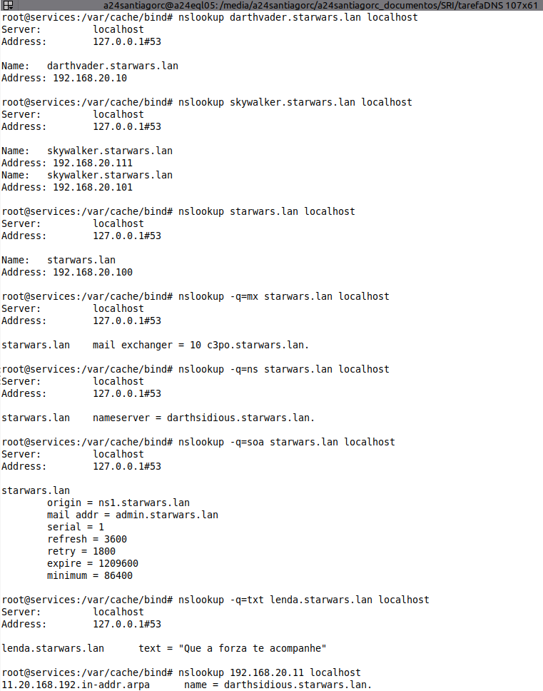

# 2. Instalación de zonas secundarias
## 2.1. Tomaremos a máquina darthsidious, e configuraremola para ser servidor secundario, tanto da zona primaria de resolución directa como de resolución inversa. Captura os ficheiros de configuración en ambalas dúas máquinas. Fai unha captura onde se vexa o reinicio da máquina darthsidious, no que se vexa no log dos dous equipos e que se fixo a transferencia de zona.
### Ficheiro named.conf.local en darthsidious
```
//
// Do any local configuration here
//

// Consider adding the 1918 zones here, if they are not used in your
// organization
//include "/etc/bind/zones.rfc1918";

// Zona directa para starwars.lan
zone "starwars.lan" {
    type slave;
    file "db.starwars.lan";
    masters { 192.168.20.10; };
};

// Zona inversa para la red 192.168.20.0/24
zone "20.168.192.in-addr.arpa" {
    type slave;
    file "db.20.168.192";
    masters { 192.168.20.10; };
};
```
### Ficheiro named.conf.local en darthvader
```
//
// Do any local configuration here
//

// Consider adding the 1918 zones here, if they are not used in your
// organization
// include "/etc/bind/zones.rfc1918";

// Zona directa para starwars.lan
zone "starwars.lan" {
    type master;
    file "/etc/bind/db.starwars.lan";
    allow-transfer { 192.168.20.11; };
};

// Zona inversa para la red 192.168.20.0/24
zone "20.168.192.in-addr.arpa" {
    type master;
    file "/etc/bind/db.20.168.192";
    allow-transfer { 192.168.20.11; };
};
```
### Ficheiro named.conf.option iguales
```
options {
	directory "/var/cache/bind";
	// forwarders {
	// 	8.8.8.8;
	// 	9.9.9.9;
	// 	// Renviador 9.9.9.9 para asegurarnos que si no funciona el 8.8.8.8 tengamos uno
	// };	
};
```
### Salida de logs
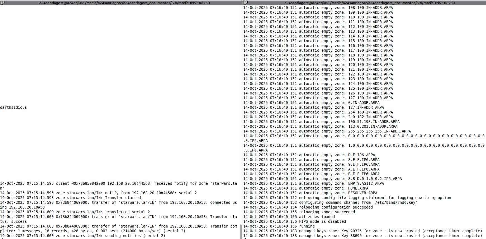

## 2.2. Engade un rexistro tipo A (Chewbacca 192.168.20.28) na zona de resolución directa e tamén na de resolución inversa.  Fai unha captura no momento do reinicio do equipo darthvader, no que se vexa o log dos dous equipos e que se amose que se fixo a transferencia de zona. Adxunta tamén unha captura do ficheiro de zona no servidor secundario.
### Salida de logs
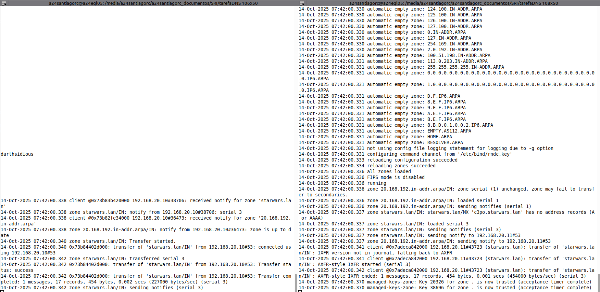
### Ficheiro db.20.168.192 en darthsidious
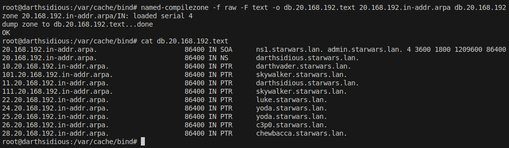
## 2.3. Comproba que o servidor secundario pode resolver ese nome.
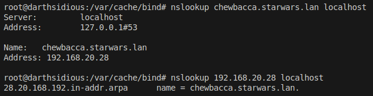
## 2.4. Fai os cambios necesarios para que as trasferencias se fagan de forma segura empregando chaves.  Repite as capturas e vídeos do punto 2, engadindo o rexistro r2d2 (192.168.20.29)
### Salida de logs
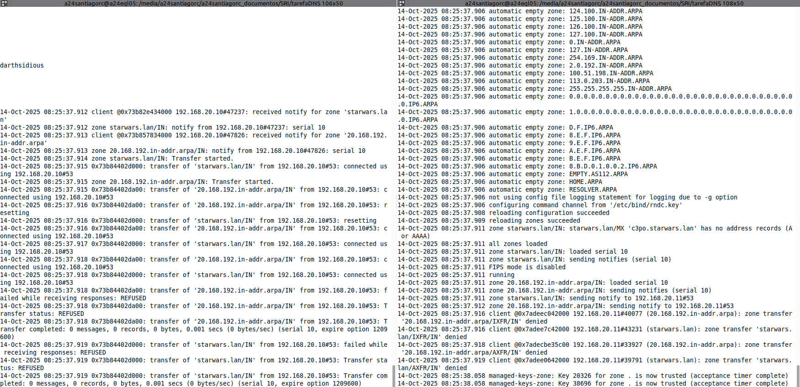
### Ficheiro db.20.168.192 en darthsidious
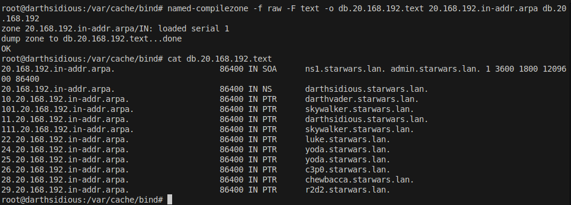

# 3. Subdominios
## 3.1. Instala no equipo lukeskywalker un subdominio chamado "mestre", e dentro del os rexistros
- A, kitfisto 192.168.20.212
- A, macewindu 192.168.20.213
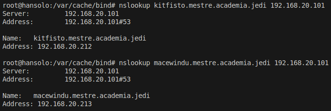
## 3.2. Instala no equipo hansolo (Windows 2012) un subdominio delegado de "academia.jedi" chamado consello. Engade nel os rexistros:
- A, yaddle 192.168.20.215
- A, yaraelpoof 192.168.20.216
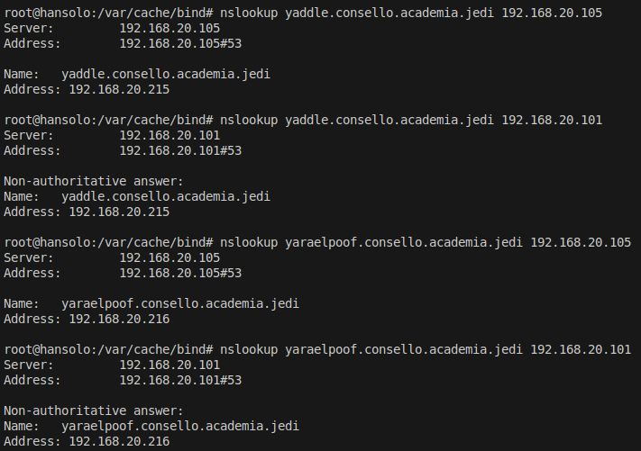
## 3.3. Instala no equipo darthvader un subdominio chamado antigarepublica, e nel os rexistros: 
- A, xendor 192.168.20.222
- A, ardenlyn 192.168.20.223
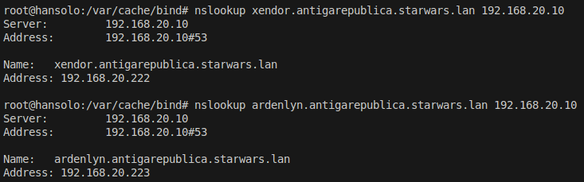
## 3.4. Instala no equipo hansolo (Debian/Ubuntu Server) un subdominio delegado de "starwars.lan" chamado imperio. Engade nel os rexistros:
- A, tsuichoi 192.168.20.225
- A, bultarswan 192.168.20.226
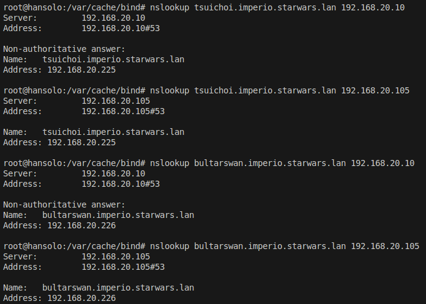

# 4. logs + utilidade rndc + nsupdate
## 4.1. Fai que no equipo darthvader se faga un log de todas as consultas (/var/log/bind/queries.log) e de todas as actualizacions (/var/log/bind/update.log) a dous ficheiros de log diferentes. Captura a configuración. Amosa as capturas dos dous ficheiros de log, despois de facer consultas e actualizacións e transferencias de zona.

## 4.2. Investiga como co comando "dig" podes pedir unha copia dunha zona.

## 4.3. Permite que o equipo darthvader poida ser controlado coa utilidade rndc desde un cliente ubuntu ou debian. Fai unha captura do servidor reiniciandose.

## 4.4. Instala unha zona dinámica no servidor darthvader chamada galaxia.lan e introduce os rexistros aaylasecura (192.168.20.239) e yarua (192.168.20.238). Esta zona debe ser cargada mediante rndc, e o servidor reiniciado con rndc. Proba tamén a eliminala con rndc. Inclue capturas do resultado dos comandos, comprobando tamén que se poden facer consultas.

## 4.5. Mediante a utilidade nsupdate, engade un rexistro chamado darthmaul (192.168.20.144) á zona starwars.lan empregando chaves.
